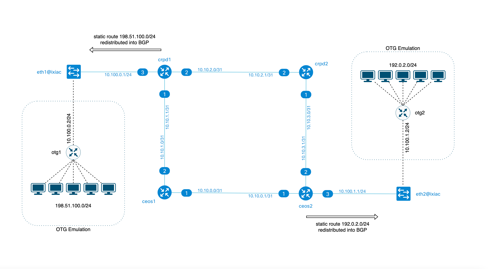

# NANOG-86 Hackathon Open Traffic Generator Lab

## OTG Containerlab topology 

The lab uses Containerlab topology file [`nanog_clab_otg_202210.yml`](nanog_clab_otg_202210.yml) with `ixia-c` traffic generator node. This node has replaced `host1` and `host2` from the [original NANOG-86 hackathon setup](nanog_clab_graphite_20221007_2.yaml).

With `ixia-c` node added, it becomes possible to introduce emulated network devices and traffic endpoints behind `ixia-c` ports. Such emulation brings more realism to the setup and allows to perform validation of the lab configuration.

For example, we can add an emulated router with a /24 network behind each `ixia-c` port. A diagram of this configuration is shown below. To define such emulated network elements with `ixia-c`, a configuration file [`otg.yml`](otg.yml) has to be applied to it. The file has to follow [Open Traffic Generator](https://otg.dev) specification.



## Prerequisites

1. Binaries needed

  * Linux host or VM with sudo permissions and Docker support
  * `git` - how to install depends on your Linux distro
  * [`yq`](https://github.com/mikefarah/yq/#install)
  * [Docker](https://docs.docker.com/engine/install/)
  * [Containerlab](https://containerlab.dev/install/)
  * [otgen](https://otg.dev/clients/otgen/) version 0.3.0 or later

    ```Shell
    curl -L "https://github.com/open-traffic-generator/otgen/releases/download/v0.3.0/otgen_0.3.0_$(uname -s)_$(uname -m).tar.gz" | tar xzv otgen
    sudo mv otgen /usr/local/bin/otgen
    sudo chmod +x /usr/local/bin/otgen
    ```

### If using AWS EC2 instance provided for NANOG Hackathon

1. Download the topology file:

  ```Shell
  curl https://raw.githubusercontent.com/bortok/clab-nanog/main/nanog_clab_otg_202210.yml -o /opt/clab/nanog_clab_otg_202210.yml
  ````

### If using an empty Linux host

1. Clone this reposotory to `/opt` as:

```Shell
sudo git clone https://github.com/bortok/clab-nanog.git /opt/clab
```

2. Add cRPD license file to `/opt/clab/files/junos_sfnt.lic`

3. If not already present, pull Docker images for Arista cEOSLab and Juniper cRPD and tag them as `ceos:latest` and `crpd:latest` respectively

## Deploy

1. Use Containerlab to launch the topology

  ```Shell
  cd /opt/clab
  sudo -E clab dep -t nanog_clab_otg_202210.yml
  ```

2. Pull MAC addresses from the running topology. Here, to we're using an API call to the `graphite` container to collect live node data information, including MAC addresses, from the running nodes.

  ```Shell
  curl -s http://localhost:8080/collect/clab/nanog86_otg/nodes/ > node-data.json
  DMAC1=`cat node-data.json | jq -r '.nodes[] | select(.hostname=="crpd1") | .interfaces["eth3"].mac_address'`
  DMAC2=`cat node-data.json | jq -r '.nodes[] | select(.hostname=="ceos2") | .interfaces["Ethernet3"].mac_address'`
  echo $DMAC1 $DMAC2
  ```
## Create OTG configuration

1. Initialize test parameters via ENV variables

  ```Shell
  OTG_API="https://clab-nanog86_otg-ixiac"
  HOST1=10.100.0.2
  HOST2=10.100.1.2
  GW1=10.100.0.1
  GW2=10.100.1.1

  TESTIP1=198.51.100.1
  TESTIP2=192.0.2.1
  ```

2. Use `otgen` tool to generate `otg.yml` file with the test parameters defined above:

  ```Shell
  otgen create device --name otg1 --ip $HOST1 --gw $GW1 --port p1 --location eth1 | \
  otgen add device    --name otg2 --ip $HOST2 --gw $GW2 --port p2 --location eth2 | \
  otgen add flow --name f1 --dmac $DMAC1 \
                    --src $TESTIP1 --dst $TESTIP2 \
                    --tx otg1 --rx otg2 | \
  otgen add flow --name f2 --dmac $DMAC2 \
                    --src $TESTIP2 --dst $TESTIP1 \
                    --tx otg2 --rx otg1 \
  > otg.yml
  ```
3. Take a look at the content of `otg.yml` you just created. Use [OTG Specification](https://redocly.github.io/redoc/?url=https://raw.githubusercontent.com/open-traffic-generator/models/master/artifacts/openapi.yaml&nocors) as a reference. Note, although we used `otgen` tool to create the file, this could be done in a variety of different ways. See more [here](https://otg.dev/clients/).

## Run OTG testing

1. Run traffic test between emulated devices using test IPs.

  ```Shell
  cat otg.yml | \
  otgen run --insecure --api $OTG_API \
            --metrics flow | \
  otgen transform --metrics flow |
  otgen display --mode table
  ```

2. Add static routes to test subnets to `cprd1` and `ceos2` routers as `ixia-c` test ports are connected to them. Redistribute static routes into BGP for remaining routers to learn them.

  ```Shell
  sudo docker exec -it clab-nanog86_otg-crpd1 cli
  configure
  set routing-options static route 198.51.100.0/24 next-hop 10.100.0.2
  set policy-options policy-statement BGP_OUT term REDIST from protocol static
  commit
  exit
  exit
  ```

  ```Shell
  sudo docker exec -it clab-nanog86_otg-ceos2 Cli
  enable
  configure terminal
  ip route 192.0.2.0/24 10.100.1.2
  router bgp 65003
    redistribute static
    exit
  exit
  ```

3. Run traffic test again

  ```Shell
  cat otg.yml | \
  otgen run --insecure --api $OTG_API \
            --metrics flow | \
  otgen transform --metrics flow |
  otgen display --mode table
  ```

## Alternative way to run OTG test

1. In the previous steps we used `otgen` tool to apply `otg.yml` configuration to `ixia-c`, but any REST API client can be used for this instead. For example, let's use `curl` as documented [here](https://otg.dev/clients/curl/)

  ```Shell
  OTG_HOST="https://clab-nanog86_otg-ixiac"
  
  cat otg.yml | yq -o=json '.' > otg.json

  curl -k "${OTG_HOST}/config" \
      -H "Content-Type: application/json" \
      -d @otg.json

  curl -k "${OTG_HOST}/control/transmit" \
      -H  "Content-Type: application/json" \
      -d '{"state": "start"}'

  watch -n 1 "curl -sk \"${OTG_HOST}/results/metrics\" \
      -X POST \
      -H  'Content-Type: application/json' \
      -d '{ \"choice\": \"flow\" }'"
  ```

## Cleanup


1. Destroy the topology

  ```Shell
  sudo -E clab des -t nanog_clab_otg_202210.yml -c
  ```
